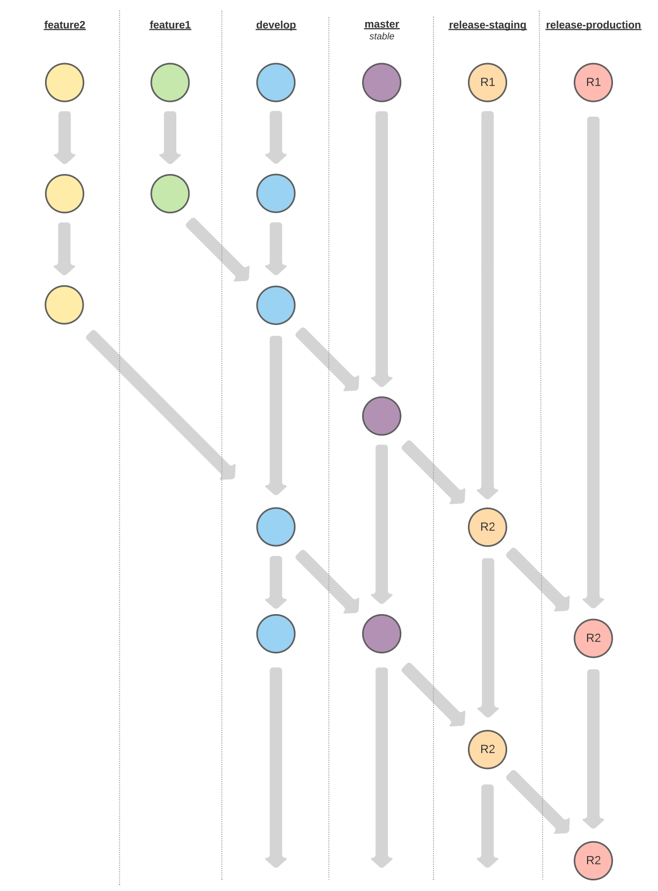

# AI Tools for the DAITA Platform

## Preprocessing and Augmentation

### Preprocessing Methods

List of preprocessing methods:

- `DiscardExif`: Rotate image according to Exif information.
- `Grayscale`: Grayscale an image.
- `NormalizeBrightness`: Adjust brightness of image to match with a reference image if the difference `> 75%`.
- `NormalizeHue`: Adjust hue of image to match with a reference image if the difference `> 75%`.
- `NormalizeSaturation`: Adjust saturation of image to match with a reference image if the difference `> 75%`.
- `NormalizeSharpness`: Adjust sharpness of image to match with a reference image if the difference `> 75%`.
- `NormalizeContrast`: Adjust constrast of image to match with a reference image if the difference `> 75%`.
- `EqualizeHistogram`: Equalize the histogram of an image if the contrast is low.
- `IncreaseResolution`: Increase resolution of a tensor image given a reference image.

### Augmentation Methods

List of augmentation methods:

- `random_rotate`: Rotate an image with random angle. Degree range: `-20` to `20`.
- `random_scale`: Zoom into a random region in an image. Scaling factor range: `0.5` to `2`.
- `random_translate`: Shift image randomly in vertical direction or horizontal direction. Shifting percentage: `-img_width * a < dx < img_width * a` or `-img_height * b < dx < img_width * b`, `a = 0.2` and `b = 0.2`.
- `random_horizontal_flip`: Flip image horizontally.
- `random_vertical_flip`: Flip image vertically.
- `random_crop`: Crop a random region in an image. Crop size: `512 x 512`.
- `random_tile`: Tile an image and extract a random patch. Patch size: `512 x 512`.
- `random_erase`: Choose a random region in image and fill it with black. Region's scale range: `0.02` to `0.3`. Region's ratio range: `0.3` to `3.3`.
- `random_gaussian_noise`: Add gaussian noise to image; `mean = 0`, `standard deviation = 0.1`.
- `random_gaussian_blur`: Blur an image with random kernel size and sigma. Kernel size range: `3` to `27`. Sigma range: `1` to `10`.
- `random_sharpness`: Enhance sharpness of image randomly. Sharpness strength: `0.5`.
- `random_brightness`: Changing brightness of image randomly. Brightness factor range: `0.75` to `1.5`.
- `random_hue`: Change hue of image randomly. Hue factor range: `-0.5` to `0.5`.
- `random_saturation`: Change saturation of image randomly. Saturation factor range: `0.5` to `1.5`.
- `random_contrast`: Change constrast of image randomly. Contrast factor range: `0.5` to `1.5`.
- `random_solarize`: Solarize an image randomly; `thresholds = 0.1`, `additions = 0.1`.
- `random_posterize`: Posterize an image randomly; `bits = 3`.
- `super_resolution`: Change resolution of an image; `scale = 2`.

### Installation

We recommend using Python versions `3.8` or `3.9`. First, create a virtual environment:
```bash
virtualenv venv
```
> The `virtualenv` package is required to create virtual environments; you can install it with `pip`: `pip install virtualenv`.

Now, activate the virtual environment:
  - Mac OS / Linux: `source venv/bin/activate`
  - Windows: `venv/Scripts/activate`

Eventually, install all dependencies:
```bash
pip install -r AI/requirements.txt --find-links=https://download.pytorch.org/whl/torch_stable.html
```

#### Deployment via Rest API on Endpoint `0.0.0.0:8000/ai`
```bash
OMP_NUM_THREADS=12 ray start --head; python AI/deploy.py
```

## How to Use

### Preprocessing Methods

```python
import requests

# Send HTTP POST request
response = requests.post(
    "http://0.0.0.0:8000/ai",
    json={
        "images_paths": [
            "AI/data/sample/images/20180810150607_camera_frontcenter_000000083.png",
            "AI/data/sample/images/20181016125231_camera_frontcenter_000183553.png",
            "AI/data/sample/images/20181108084007_camera_frontcenter_000029570.png",
            "AI/data/sample/images/20181108123750_camera_frontcenter_000004559.png",
            "AI/data/sample/images/20190401145936_camera_frontcenter_000017970.png"
        ],
        "output_folder": "AI/data/sample/output/",
        "type": "preprocessing",
        "codes": [],
    }
)
print(response.json())
```

### Augmentation Methods

```python
import requests

# Send HTTP POST request
response = requests.post(
    "http://0.0.0.0:8000/ai",
    json={
        "images_paths": [
            "AI/data/sample/images/20180810150607_camera_frontcenter_000000083.png",
            "AI/data/sample/images/20181016125231_camera_frontcenter_000183553.png",
            "AI/data/sample/images/20181108084007_camera_frontcenter_000029570.png",
            "AI/data/sample/images/20181108123750_camera_frontcenter_000004559.png",
            "AI/data/sample/images/20190401145936_camera_frontcenter_000017970.png"
        ],
        "output_folder": "AI/data/sample/output/",
        "type": "augmentation",
        "num_augments_per_image": 2,
        "codes": [],
    }
)
print(response.json())
```

## Libraries
- Preprocessing on CPU: [Scikit-image](https://github.com/scikit-image/scikit-image)
- Augmentation on GPU and CPU: [Kornia](https://github.com/kornia/kornia)
- Deploy on REST API: [Ray](https://github.com/ray-project/ray)

---

## A Note on Releases

The repository should be setup in the future in such a way that changes to the branch `release-staging` and `release-production` will trigger a rebuild of the Staging and the Production application, respectively.

The merge flow for changes should be as follows:

```bash
<feature_branch> -> <develop> -> <main> -> <release-staging> -> <release-production>
```


